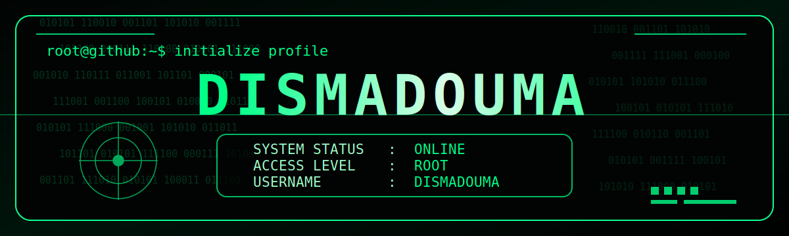

<div align="center">



<br>

# DISMADOUMA

### Full Stack Developer • System Builder • Clean Code

<div align="center">

<table>
  <tr>
    <td align="left"><code>SYSTEM STATUS</code></td>
    <td align="center"><code>:</code></td>
    <td align="left"><code>ONLINE</code></td>
  </tr>
  <tr>
    <td align="left"><code>ACCESS LEVEL</code></td>
    <td align="center"><code>:</code></td>
    <td align="left"><code>ROOT</code></td>
  </tr>
  <tr>
    <td align="left"><code>USERNAME</code></td>
    <td align="center"><code>:</code></td>
    <td align="left"><code>DISMADOUMA</code></td>
  </tr>
  <tr>
    <td align="left"><code>ROLE</code></td>
    <td align="center"><code>:</code></td>
    <td align="left"><code>FULL STACK DEVELOPER</code></td>
  </tr>
</table>

</div>
</div>

---

## 🧠 About Me

```bash
┌──(root㉿dismadouma)-[~/profile]
└─$ whoami
```

```txt
Name      : dismadouma
Role      : Full Stack Developer
Status    : Online
Focus     : Web Development, Backend, API, Database, Automation, Bot Development
Mission   : Build clean, powerful, elegant, and secure systems
```

---

## ⚡ Tech Stack

<table align="center">
  <tr>
    <td><b>Frontend</b></td>
    <td>HTML, CSS, JavaScript, TypeScript, React, Next.js</td>
  </tr>
  <tr>
    <td><b>Backend</b></td>
    <td>Node.js, Express.js, PHP, Laravel, Python, Flask</td>
  </tr>
  <tr>
    <td><b>Database</b></td>
    <td>MySQL, PostgreSQL, MongoDB, SQLite, Redis</td>
  </tr>
  <tr>
    <td><b>Tools</b></td>
    <td>Git, GitHub, VS Code, Linux, Docker, Cloudflare</td>
  </tr>
  <tr>
    <td><b>Bot Dev</b></td>
    <td>Discord Bot, Telegram Bot, Automation Script</td>
  </tr>
</table>

---

## 📊 Skill Progress

```txt
HTML        ████████████████████ 100%
CSS         ████████████████████ 100%
JavaScript  ████████████████████ 100%
TypeScript  ████████████████░░░░ 80%
Python      ████████████████████ 100%
PHP         ████████████████░░░░ 80%
Node.js     ████████████████████ 100%
React       ████████████████░░░░ 80%
Next.js     ███████████████░░░░░ 75%
Database    ██████████████████░░ 90%
API         ████████████████████ 100%
Automation  ████████████████████ 100%
```

---

## 🖥️ Developer Console

```bash
┌──(dismadouma㉿github)-[~/project]
└─$ sudo start system
```

```txt
[ OK ] Loading frontend module
[ OK ] Loading backend module
[ OK ] Connecting database
[ OK ] Starting API service
[ OK ] Deploying project
[ OK ] System ready
```

---

## 🚀 What I Build

```txt
[+] Website Application
[+] Admin Dashboard
[+] REST API
[+] Discord Bot
[+] Telegram Bot
[+] Automation Tools
[+] Database System
[+] Payment Integration
[+] Clean UI System
[+] Full Stack Project
```

---

## 🧬 Code Philosophy

```js
const dismadouma = {
  role: "full stack developer",
  code: "clean, fast, secure",
  mindset: "debug everything",
  mission: "build powerful systems"
};

while (true) {
  learn();
  build();
  debug();
  improve();
  deploy();
}
```

---

<div align="center">

## 💻 Terminal Quote

```txt
I do not just write code.
I build systems.
```

<br>

```txt
THANK YOU FOR VISITING MY PROFILE
SYSTEM NEVER SHUTDOWN
DISMADOUMA ALWAYS ONLINE
```

</div>
